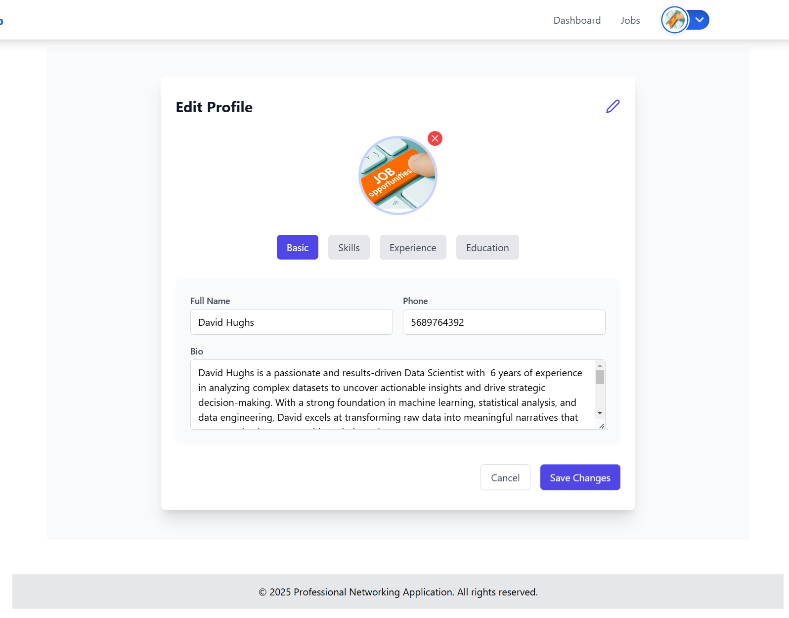

# User Guide for [Professional Networking Application]

## Table of Contents

1. Introduction
2. System Requirements
3. Getting Started
4. Features and Functionalities
   - Dashboard Overview
   - User Management
   - Data Management 
   - Reports and Analytics
5. How to Perform Key Actions
   - Logging In and Out 
   - Creating a New User 
   - Managing Your Profile 
   - Generating Reports
6. Troubleshooting and FAQs
7. Support and Contact Information

## 1. Introduction
Welcome to Professional Networking Application, a Platform designed to bridge the gap between job seekers and employers. It includes features for job posting, application tracking, application review, profile management and user management. This guide provides step-by-step instructions on how to navigate and use the application effectively.

## 2. System Requirements
- Operating System: Windows, macOS, Linux
- Web Browser: Latest versions of Chrome, Firefox, Safari, or Edge
- Internet Connection: Stable and reliable internet connection
- SMTP_SERVER
- Database: PostgreSQL
- Python 3.8 or higher
- Flask
- Flask-Migrate
- Flask-SQLAlchemy
- python-dotenv
- psycopg2-binary
- flask-bcrypt
- PyJWT
- requests
- flask-cors

## 3. Getting Started
To get started with the application, follow these steps:
### 3.1. Registration and Setup
- Visit the application's homepage (http://localhost:3000/) or https://www.eduapi.icu/.
- Click "Signup" on the homepage.
  
- Click "Sign Up" and fill out the registration form.

  
### 3.2. Logging In
- Click "Login" on the homepage.
- Enter your username and password.
  
- Then click "Login" to access your account.

## 4. Features and Functionalities
### 4.1. Job Seeker:
### 4.1.1. Dashboard Overview
**The Dashboard provides a summary of key metrics and quick access to core features:**
- Quick Stats: Overview of user activity, pending tasks, etc.
- Shortcuts: Buttons for frequently used features like "Add New User" or "Generate Report".

### 4.1.2. Profile Management
**The Profile Management feature allows users to manage their profile information:**
- Create Profile: Create a new profile with personal information, contact details, and other profile details.
- View Profile: View and edit personal information, contact details, and other profile details.
   - Click the dropdown menu on the top right corner of the page.
  
   - Click on the "My Profile" option.
  
- Edit Profile: Update personal details, contact information, and other profile details.
   - Click on the "Edit Profile" button.
  
  

   - Click on the "Save changes" button save edited changes.

### 4.1.3. Job Search & Applications
**The Job Search feature allows users to search for jobs based on various criteria:**
- Search by Keyword: Enter keywords related to the job you're looking for.
- Filter by Category: Select Category to narrow down job listings.
- Select particular job by clicking on it and viewing its details.
- Apply for the job by clicking on the "Apply" button.

- To attach cover letter and cv for the job click on the "Apply" button.

- To apply for the job click on the "Submit Application" button.

### 4.2 Job Publisher:
### 4.2.1. Dashboard Overview
**The Dashboard provides a summary of key metrics and quick access to core features:**
- Quick Stats: Overview of user activity, pending applications, etc.
### 4.2.2. Job Posting
**The Job Posting feature allows users to post jobs:**
- Create Job Posting: Create a new job posting with job details, requirements, and other relevant information.
     - Click on the "Create Job" button.
     
     - Fill out the job details, requirements, and other relevant information.
     
     - Click on the "Create Job" button.
- View Job Posting: View and edit job postings.
     - Click on the "Job" button.
     
- Edit Job Posting: Update job details, requirements, and other relevant information.
     - Click on the "Edit Job" button.
     - Fill out the job details, requirements, and other relevant information.
     
     - Click on the "Save changes" button.
- Delete Job Posting: Delete job postings.
     - Click on the "Delete Job" button.
     - Click on the "Delete" button.
  
### 4.2.3. Application Review
**The Application Review feature allows users to review and manage job applications:**
- View Applications: View and manage
- Review Applications: Review and manage job applications.
- Accept or Reject Applications: Accept or reject job applications.
- Send Interview Invitations: Send interview invitations to selected applicants.
- Track Application Status: Track the status of job applications.
- View Application Details: View detailed information about a specific job application.
- Download Application Documents: Download application documents.
- Delete Applications: Delete job applications.
- Search Applications: Search for job applications based on various criteria.
- Filter Applications: Filter job applications based on various criteria.

### 4.3 Admin:
### 4.3.1. Dashboard Overview
**The Dashboard provides a summary of key metrics and quick access to core features:**
- Quick Stats: Overview of user activity, pending tasks, etc.

- Shortcuts: Buttons for frequently used features like "Add New User" or "Generate Report".
- Click on the "Add New User" button.
- Fill out the registration form.
- Click on the "Create User" button.
- Click on the "View Users" button.
- Click on the "Delete User" button.
- Click on the "Edit User" button.
- Click on the "View Report" button.

### 4.3.2. User Management
- View Users: View and manage user accounts.

- Create User: Create a new user account.
- Edit User: Edit user account information.
- Delete User: Delete user accounts.
- Search Users: Search for user accounts based on various criteria.
- Filter Users: Filter user accounts based on various criteria.
- Download User Reports: Download user reports.
- Export User Data: Export user data.
- Import User Data: Import user data.
- Reset User Password: Reset user passwords.
- Lock User Account: Lock user accounts.
- Unlock User Account: Unlock user accounts.
- Suspend User Account: Suspend user accounts.
- Unsuspend User Account: Unsuspend user accounts.
- Change User Role: Change user roles.
- View User Activity: View user activity logs.
- View User Reports: View user reports.

